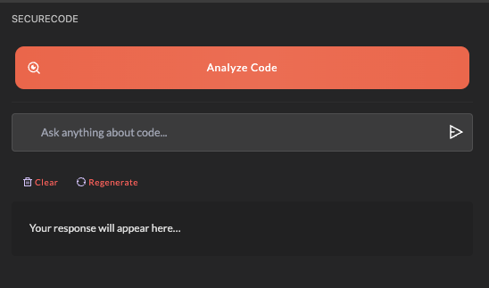
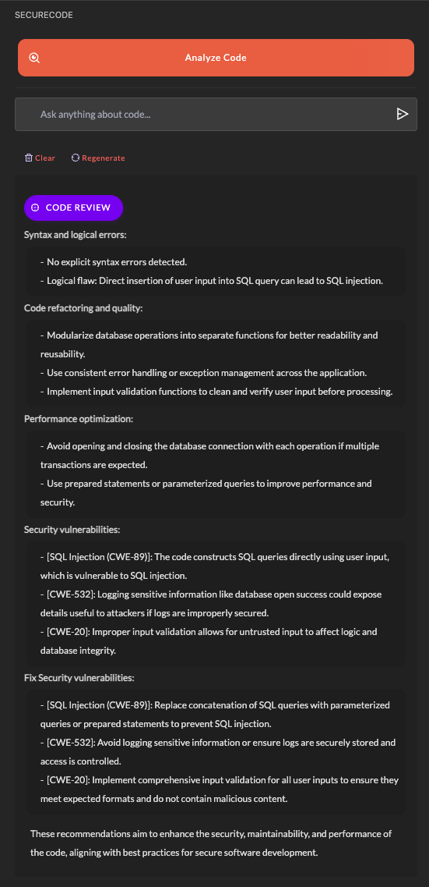
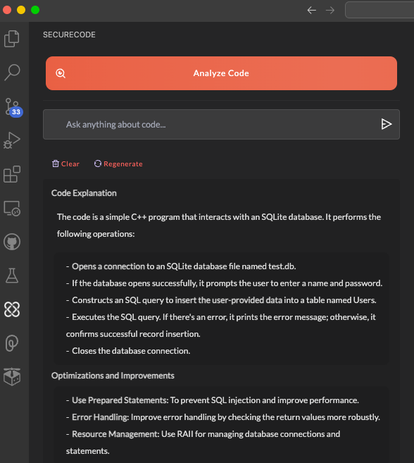
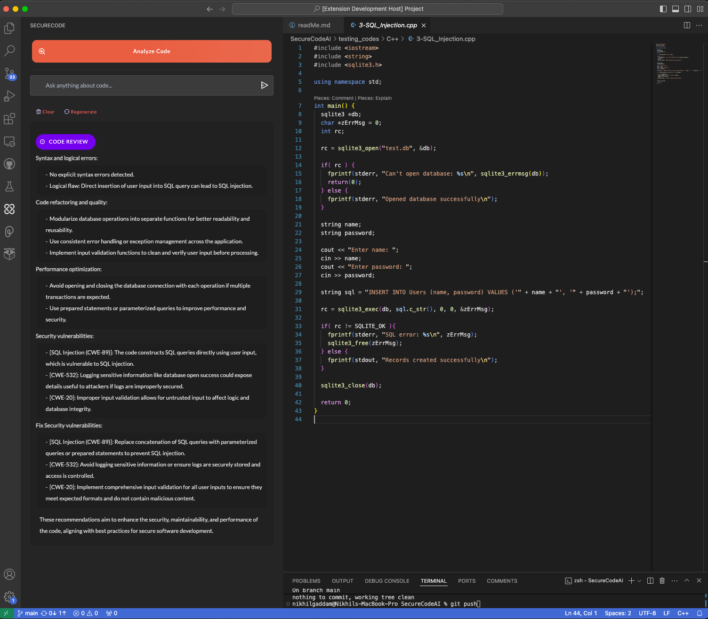

# SecureCode AI

SecureCode AI is a Visual Studio Code extension designed to enhance software security by leveraging OpenAI's language models to identify and suggest fixes for security vulnerabilities in real-time during code development.

## Features

- **Real-time Vulnerability Detection**: Scans code as you write, identifying potential security threats such as SQL injections, XSS, and buffer overflows.
- **Context-Aware Suggestions**: Provides suggestions for code improvement to prevent security vulnerabilities based on the context of your current project.
- **Seamless Integration**: Works within your VS Code environment without disrupting your workflow.
- **Supports Multiple Languages**: Effective across multiple programming languages, including Java, Python, and C++.

## Installation

To install SecureCode AI, follow these steps:

1. Open Visual Studio Code.
2. Go to the Extensions view by clicking on the square icon on the sidebar or pressing `Ctrl+Shift+X`.
3. Search for "SecureCode AI".
4. Click on `Install` to install the extension.

## Usage

Once installed, the extension will automatically begin scanning your files for vulnerabilities as you type. Detected issues will be highlighted, and suggestions for mitigation will appear in a side panel.

## Screenshots

Here are some screenshots demonstrating SecureCode AI in action:

*Overview of the SecureCode AI interface within VS Code.*

*Example of real-time vulnerability detection.*

*SecureCode AI suggesting security improvements.*

## Authors

SecureCode AI was developed by [Nikhil Gaddam](https://github.com/NikhilGaddam) and [Ram Prashanth Azhagappa Selvan](https://github.com/ram-prashanth), graduate students at Virginia Tech. This project was part of the coursework for CS_5590 Software System and Security, focusing on integrating AI with software security practices.

## Contributing

Contributions to SecureCode AI are welcome! Here's how you can contribute:

- **Reporting Bugs**: If you find a bug, please report it by opening an issue in the repository.
- **Suggesting Enhancements**: Have an idea to make SecureCode AI better? Provide your suggestions through an issue.
- **Pull Requests**: Want to contribute directly to the code? Fork the repository, make your changes, and submit a pull request.

## Support

If you need assistance with SecureCode AI, please open an issue in this repository with a detailed description of your problem or question.

---

SecureCode AI is continually evolving, and we are committed to providing developers with the best tools to ensure software security. Thank you for supporting SecureCode AI!
